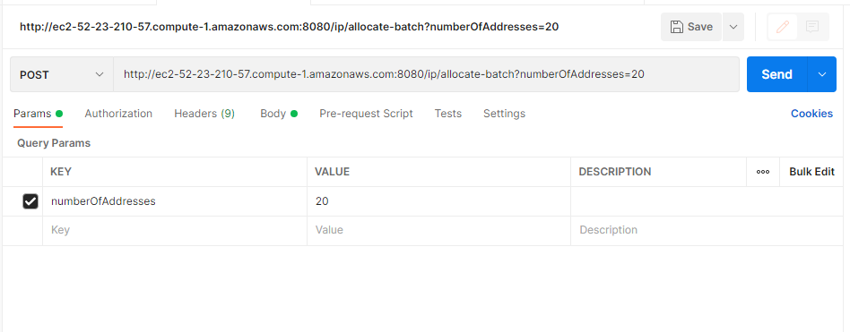
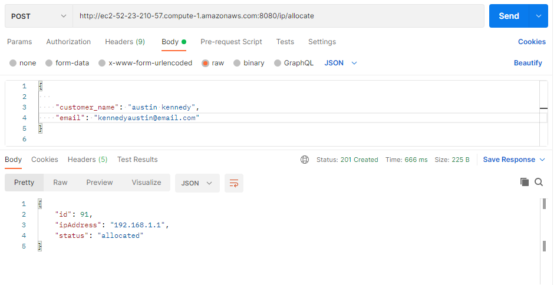
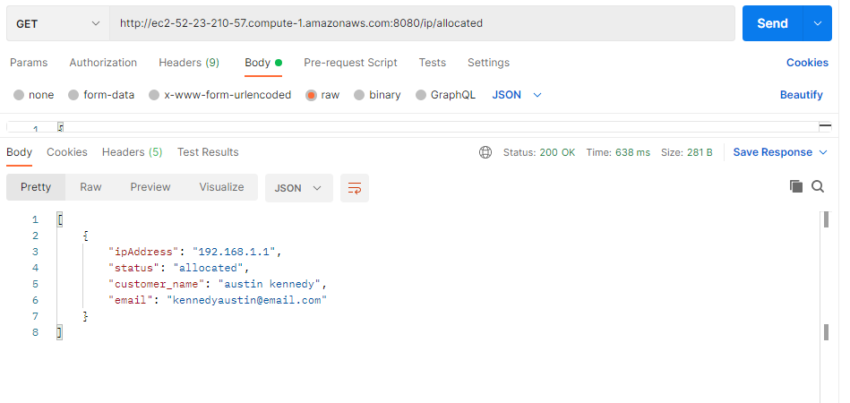
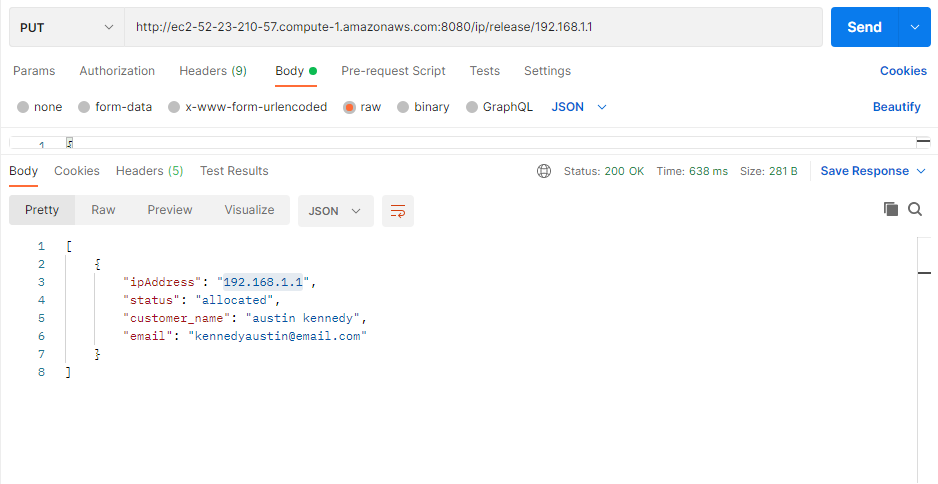
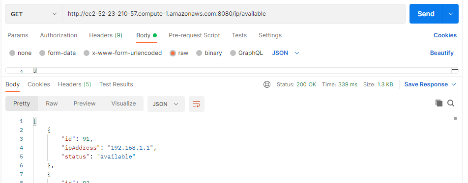
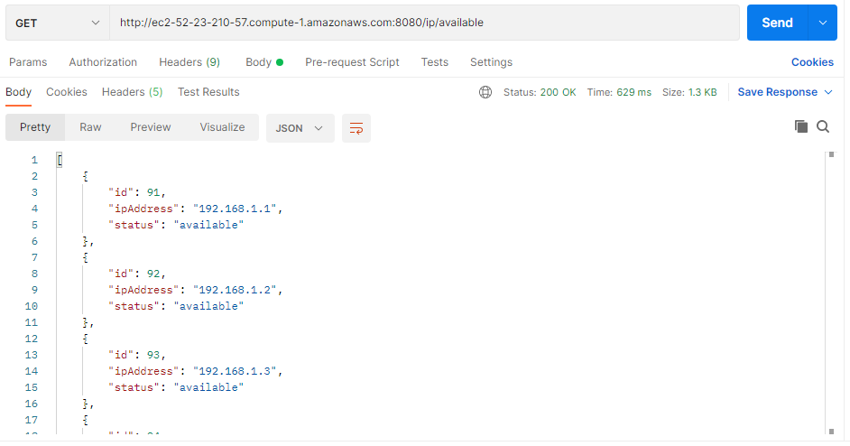

#### _DISCLAIMER 1_

I had to host in aws free tier Ec2 instance and use aws Mysql free tier RDS provision as Heroku no longer supports free tier.

#### _DISCLAIMER 2_

This is a Java Springboot application therefore adopts the MVC architecture.
The tool Postman can be used to test the API endpoints better. I will attach the screenshots and explanations at the end of this file..

# IP Management System - README

This README provides information about the available endpoints for the IP Management System hosted at http://ec2-52-23-210-57.compute-1.amazonaws.com:8080.

# Endpoints

The IP Management System provides the following RESTful endpoints:

### _POST_ http://ec2-52-23-210-57.compute-1.amazonaws.com:8080/ip/allocate-batch?numberOfAddresses={count}:

- _http://ec2-52-23-210-57.compute-1.amazonaws.com:8080/ip/allocate-batch_\*
  Allocate a batch of IP addresses (specified by numberOfAddresses).
  Description: Allocates a batch of IP addresses.
  Request Parameter: numberOfAddresses - The number of IP addresses to allocate.
  Response: Returns a list of allocated IP addresses.

Allocate maybe 20 ips.A number of choice below

We see the number of allocated Ips below. The 20 ipaddresses are persisted in the database with status available..

### _POST_ http://ec2-52-23-210-57.compute-1.amazonaws.com:8080/ip/allocate

Description: Allocates an IP address to a customer.
Request Body:
json
Copy code
{
"customer_name": "John Doe",
"email": "john.doe@example.com"
}

Response: Returns the allocated IP address and customer details.

Allocate to the user name and emaail details of the customer passesed in the body as shwon above.

## _GET_ http://ec2-52-23-210-57.compute-1.amazonaws.com:8080/ip/allocated

Description: Retrieves a list of allocated IP addresses along with customer details.
Response: Returns a list of allocated IP addresses with associated customer details.

The allocated ip and the customer details as shown above..

### _PUT_ http://ec2-52-23-210-57.compute-1.amazonaws.com:8080/ip/release/{ipAddress}

Description: Releases a previously allocated IP address.
Path Variable: {ipAddress} - The IP address to release.
Response: Returns a success status.

We can see that the ip address goes back to the pool of the available ips

### _GET_ http://ec2-52-23-210-57.compute-1.amazonaws.com:8080/ip/available

Description: Retrieves a list of available IP addresses.
Response: Returns a list of available IP addresses.

Available ip addresses as shown above..
